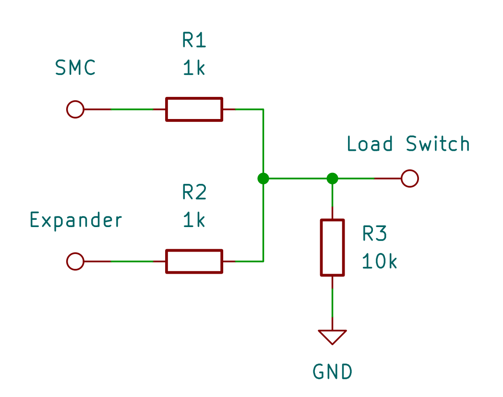

# Power Latching

At the moment, the SMC controls the load switch to the Pi.
This may make it difficult to handle SMC firmware updates from the Pi, since the Pi would suddenly lose power if the SMC resets into the bootloader.

To solve this, the Pi should be able to latch the load switch during this process.
There's a spare GPIO on the expander near the load switch that can be used.

We effectively want to OR the two signals together, such that the Pi stays on if either (or both) outputs are active.

Conveniently, the TPS22965x load switches have a really low input threshold of >1.2V to turn the switch on, and <0.45V to turn it off.
This means we can achieve all the desired states with just resistors like this:

Checking through the valid combinations of output voltages and their resultant voltage at the load switch:
| V\_SMC | V\_Expander | V\_Loadswitch | I\_SMC   | I\_Expander |
| ------ | ----------- | ------------- | -------- | ----------- |
| 0V     | 0V          | 0V            | 0mA      | 0mA         |
| 0V     | 3.3V        | 1.57V         | \-1.57mA | 1.73mA      |
| 0V     | Hi-Z        | 0V            | 0mA      | 0mA         |
| 3.3V   | 0V          | 1.57V         | 1.73mA   | \-1.57mA    |
| 3.3V   | 3.3V        | 3.14V         | 0.16mA   | 0.16mA      |
| 3.3V   | Hi-Z        | 3V            | 0.3mA    | 0mA         |
| Hi-Z   | 0V          | 0V            | 0mA      | 0mA         |
| Hi-Z   | 3.3V        | 3V            | 0mA      | 0.3mA       |
| Hi-Z   | Hi-Z        | 0V            | 0mA      | 0mA         |

We can see that the current at each output is well within their respective drive strength limits.