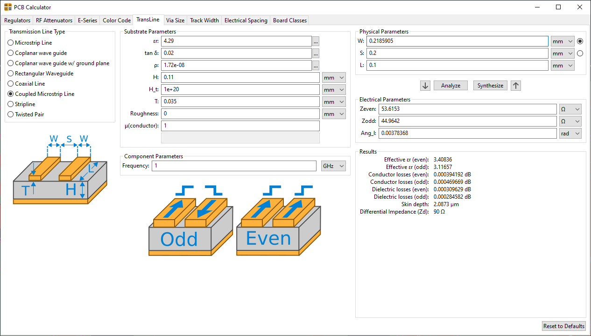

# Differential Impedance Calculation for USB Data Signal

Values based on a standard 0.8mm 4 layer board from PCBWay (2116 PrePreg):
https://www.pcbway.com/multi-layer-laminated-structure.html

Calculation done using KiCad's impedance caclculator:

